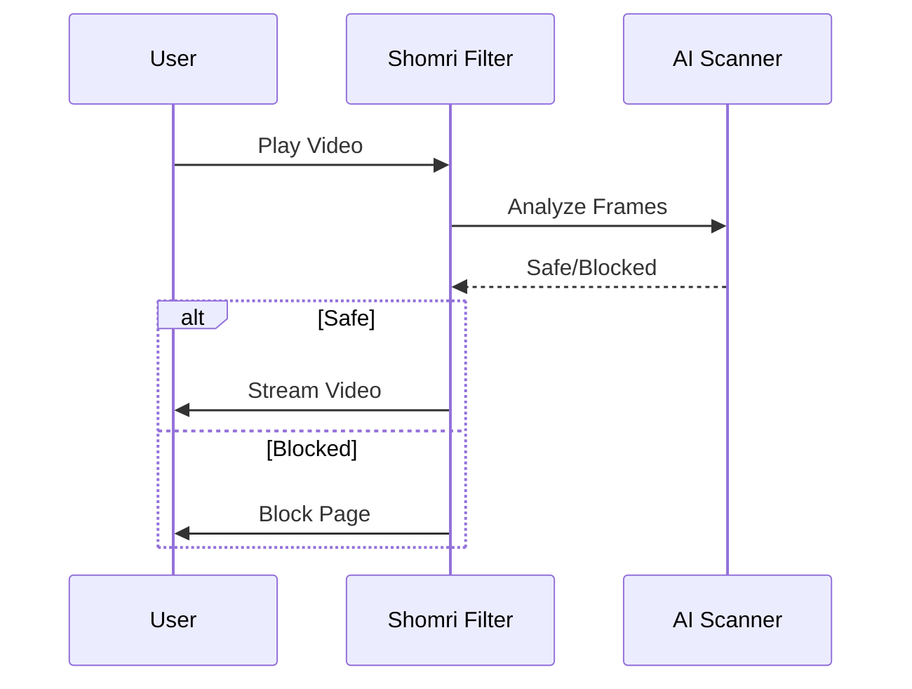

## Overview

Shomri provides powerful tools to keep your devices safe while maintaining usability. You can customize filters for apps and websites, scan video content in real-time, handle access requests remotely, and ensure browsing remains fast and uninterrupted. These features work together to create a seamless experience tailored to your needs.

<Callout kind="info">
  Start by setting up your Shomri account at <a href="https://shomri.com/auth" target="_blank">shomri.com/auth</a> to access the dashboard.
</Callout>

## Key Features

Explore the main capabilities through these highlighted features.

<Columns cols={2}>
  <Card title="Custom Filters" icon="settings" href="#customizing-blocks">
    Block specific apps and sites with granular control.
  </Card>
  <Card title="Video Scanning" icon="video" href="#video-scanning">
    Real-time AI analysis for video content.
  </Card>
  <Card title="Remote Requests" icon="smartphone" href="#remote-requests">
    Approve access from anywhere.
  </Card>
  <Card title="Fast Browsing" icon="zap" href="#fast-browsing">
    Optimized performance without slowdowns.
  </Card>
</Columns>

<Image
  src="https://shomri.com/assets/app-screenshot-settings-CN2tzxPT.png"
  alt="Shomri settings dashboard showing filter options"
  width="800"
  height="600"
/>

## Customizing App and Website Blocks

Tailor blocks to your exact requirements using the Shomri dashboard.

<Tabs>
  <Tab title="Apps" icon="smartphone">
    Select apps to block or allow based on categories or individually.
  </Tab>
  <Tab title="Websites" icon="globe">
    Add custom URL patterns for precise website filtering.
  </Tab>
</Tabs>

Follow these steps to configure blocks:

<Steps>
  <Step title="Access Dashboard" icon="monitor">
    Log in to your Shomri account at `https://dashboard.shomri.com`.
  </Step>
  <Step title="Select Device" icon="device-mobile">
    Choose the device from your managed list.
  </Step>
  <Step title="Add Rules">
    Navigate to Filters > Apps or Websites.
    
````json
{
  "apps": {
    "block": ["social-media-app", "gaming-app"],
    "allow": ["airline-app", "banking-app"]
  },
  "websites": {
    "block_patterns": ["*social-site.com/*", "*gambling-site*"],
    "allow": ["trusted-site.com"]
  }
}
````
  </Step>
  <Step title="Apply Changes" icon="check-circle">
    Save and sync to the device instantly.
  </Step>
</Steps>

<Callout kind="tip">
  Use wildcards like `*example.com/*` for flexible matching.
</Callout>

## Real-time Video Content Scanning

Shomri uses AI to analyze video frames as they stream, blocking inappropriate content without buffering delays.

### How It Works



<Expandable title="Advanced Scanning Options" default-open="false">
  Customize sensitivity levels:
  
  | Level | Description | Use Case |
  |-------|-------------|----------|
  | Light | Basic keyword detection | Everyday browsing |
  | Medium | Frame analysis + audio | Family devices |
  | Strict | Full AI deep scan | High protection |
</Expandable>

## Handling Access Requests Remotely

When a block occurs, users can request access, which you approve from any device.

<ParamField path="request_id" param-type="string" required="true">
  Unique ID for the request.
</ParamField>

<ParamField query="reason" param-type="string" required="false">
  User's explanation for access.
</ParamField>

Example approval via dashboard API:

<CodeGroup tabs="cURL,JavaScript">
````bash
curl -X POST https://api.shomri.com/v1/requests/{request_id}/approve \
  -H "Authorization: Bearer YOUR_API_KEY" \
  -d '{"reason": "approved"}'
````

````javascript
const response = await fetch(`https://api.shomri.com/v1/requests/${requestId}/approve`, {
  method: 'POST',
  headers: {
    'Authorization': `Bearer ${YOUR_API_KEY}`,
    'Content-Type': 'application/json'
  },
  body: JSON.stringify({ reason: 'approved' })
});
````
</CodeGroup>

## Ensuring Fast Browsing Without Interruptions

Shomri optimizes performance by caching safe content and using lightweight scanning.

- **No VPN slowdowns**: Direct filtering without routing all traffic.
- **Smart caching**: Pre-approved sites load instantly.
- **Minimal battery impact**: Efficient background processing.

<Image
  src="https://shomri.com/assets/app-screenshot-blocked-ySGux4ui.png"
  alt="Shomri blocked page with request access option"
  width="800"
  height="600"
/>

<Callout kind="success">
  Users report browsing speeds `>95%` of unfiltered performance.
</Callout>

## Next Steps

<Columns cols={3}>
  <Card title="Quickstart" icon="rocket" href="/quickstart">
    Set up Shomri in minutes.
  </Card>
  <Card title="Authentication" icon="shield" href="/authentication">
    Secure your account.
  </Card>
  <Card title="Support" icon="help-circle" href="https://shomri.com/support" target="_blank">
    Get help anytime.
  </Card>
</Columns>